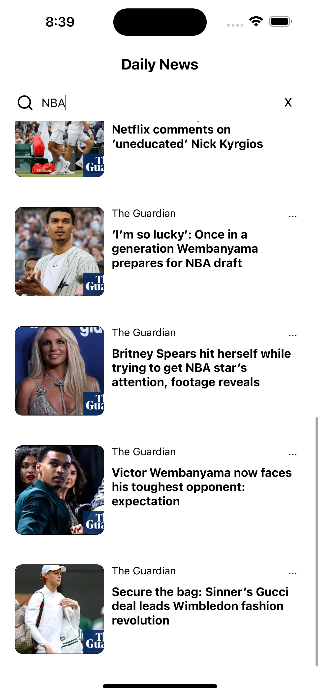

## Android


## IOS



# News App

This application uses the NEWS API to provide users with the latest news from around the world. It is built using Redux Thunk, React Native Paper, Navigation, and Axios. With typescript!!

## Features

- Search News: Users can search for news articles based on keywords or specific topics.
- Latest News: The app displays the most recent news articles from various sources.
- One-Click Read: Users can read the full article with just one click.


## Application Used
- Redux Thunk: Implements Redux Thunk middleware for handling asynchronous actions.
- React Native Paper: Utilizes the React Native Paper library for UI components.
- Navigation: Implements navigation for seamless user experience.
- Axios: Uses Axios for making HTTP requests to the NEWS API.

Make sure to register and API key from the [NewsAPI](https://newsapi.org/) and add a file `.env` in the main directory that includes the following;

```bash
API_KEY=YOUR_API_KEY 
```

## Installation

To install and run the application locally, follow these steps:

1. Clone the repository:

   ```shell
   git clone https://github.com/j3kin000/DailyNews.git
   ```
